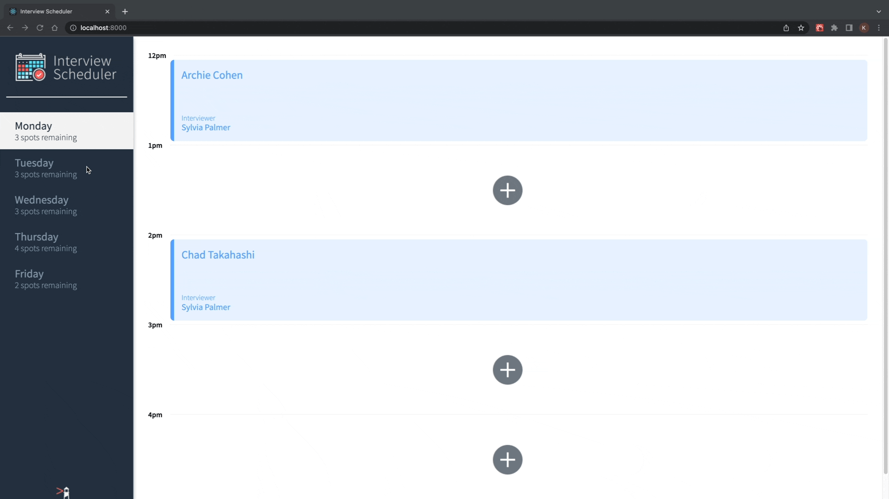

# Interview Scheduler

This is a single-page app built on React.js that allows students to book, edit or cancel an interview with an instructor.

## Final App

## Setup

Install dependencies with `npm install`.

## Running Scheduler-API Server
Install this [scheduler-api](https://github.com/keniabalestra/scheduler-api) following the README instructions.
## Running Webpack Development Server

```sh
npm start
```

## Running Jest Test Framework

```sh
npm test
```

## Running Storybook Visual Testbed

```sh
npm run storybook
```

## Technical Specifications
* React
* Webpack
* Babel
* Storybook
* Jest
* Webpack Dev Server
* React Testing Library

Both servers run concurrently; requests are proxied from the Webpack development server to the API server.
